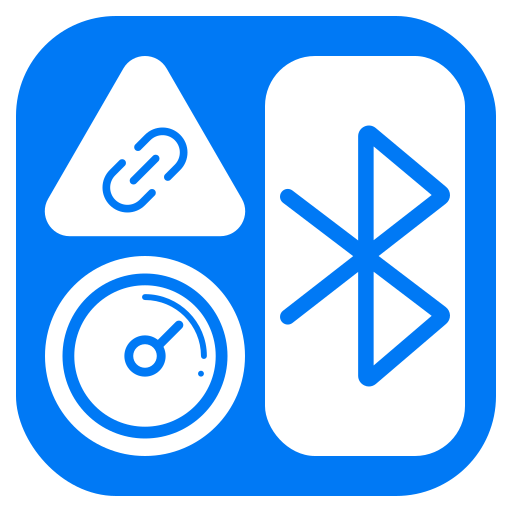

<div align="center">
  
</div>
<h1 align="center">BLE调试助手 - BLE Helper</h1>
<p align="center">
    <a href="https://github.com/luckyloogn/BleHelper/releases/latest"></a>
    <a href="https://github.com/luckyloogn/BleHelper/actions/workflows/windows.yml"></a>
    <a href="https://github.com/luckyloogn/BleHelper/actions/workflows/linux.yml"></a>
</p>

## 说明

一款基于 [Qt](https://www.qt.io/) ([6.8.1](https://www.qt.io/blog/qt-6.8.1-released)) 和 [FluentUI](https://github.com/zhuzichu520/FluentUI/) ([1.7.7](https://github.com/zhuzichu520/FluentUI/tree/1.7.7)) 的桌面端低功耗蓝牙 (BLE) 调试助手

## 截屏


## 功能

- BLE 设备扫描, 配对, 收藏, 过滤和连接
- 管理已收藏的 BLE 设备
- 读取和写入特征, 启用/禁用特征通知或指示
- 读取描述符
- 对 "Unknown Service" 和 "Unknown Characteristic" 重命名并保存为 UUID 字典
- 管理 UUID 字典
- 设置应用的外观和本地化等

## 安装

### Windows

1. 从 [Releases](https://github.com/luckyloogn/BleHelper/releases/latest) 页面下载最新的 **exe** 安装程序 (BleHelper_x.x.x_win64_msvc2022_64_Qt6.8.1.exe)
2. 双击运行安装程序，按照向导完成安装即可

### Linux

1. 从 [Releases](https://github.com/luckyloogn/BleHelper/releases/latest) 页面下载最新的 **AppImage** 软件包 (BleHelper_x.x.x_linux_gcc_64_Qt6.8.1.AppImage)
2. 使用终端命令 `chmod +x BleHelper_x.x.x_linux_gcc_64_Qt6.8.1.AppImage` 赋予执行权限
3. 通过终端命令 `./BleHelper_x.x.x_linux_gcc_64_Qt6.8.1.AppImage` 运行程序

## 构建

### 安装 Qt

使用 [Qt 在线安装程序](https://download.qt.io/archive/online_installers/) 安装 Qt, 版本不低于 6.7.0, 同时在 **Additional Libraries** 中
勾选 `Qt 5 Compatibility Module`, `Qt Connectivity`, `Qt Shader Tools`

**注意1**: Windows 必须选择 MSVC (MinGW 无法使用蓝牙), 同时使用 [Visual Studio Installer](https://visualstudio.microsoft.com/zh-hans/vs/) 安装对应版本的 MSVC 生成工具

**注意2**: 由于 [QTBUG-132202](https://bugreports.qt.io/browse/QTBUG-132202), 对于 Windows 平台, Qt 6.7.0 - 6.8.1 在读取 Characteristic User Description 时会出现乱码, 
如在意此问题, 可根据 [此贴](https://forum.qt.io/topic/160084/how-to-solve-the-problem-of-garbled-characters-in-characteristic-names-for-lowenergyscanner-on-the-windows-platform/19?_=1735141953474) 修改 [qtconnectivity](https://github.com/qt/qtconnectivity/) 源码, 编译出 `Qt6Bluetooth.dll` 补丁, 然后按照 [这个](https://github.com/luckyloogn/build-qtconnectivity?tab=readme-ov-file#%E4%BD%BF%E7%94%A8%E4%BF%AE%E5%A4%8D%E5%90%8E%E7%9A%84-qt6bluetoothdll) 打补丁; 如果使用 Qt 6.8.1, 也可以直接在 [这里](https://github.com/luckyloogn/build-qtconnectivity/releases) 下载补丁

### 克隆本仓库

```bash
git clone https://github.com/luckyloogn/BleHelper.git
```

### 编译项目

#### 方法1: 使用 [Qt Creator](https://www.qt.io/download#qt-creator)

使用 **Qt Creator** 打开顶层 [CMakeLists.txt](./CMakeLists.txt), 按照引导配置项目 (构建套件使用 MSVC), 然后点左下角运行按钮 (绿色三角) 进行编译运行

#### 方法2: 使用命令行

##### Windows (CMD)

```bash
# 下面这一条命令以 Qt 6.8.1, MSVC 2022 64bit 为例, 请自行修改为您的 MSVC 生成工具的版本和路径
call "C:\Program Files\Microsoft Visual Studio\2022\Community\VC\Auxiliary\Build\vcvarsall.bat" x64 
cd BleHelper
mkdir build
cd build
# -DCMAKE_PREFIX_PATH 指定 Qt 安装路径, Qt 6.8.1 默认安装在 C:/Qt/6.8.1/msvc2022_64, 根据您的安装路径进行修改
cmake -DCMAKE_PREFIX_PATH=C:/Qt/6.8.1/msvc2022_64 -DCMAKE_C_COMPILER=cl -DCMAKE_CXX_COMPILER=cl -DCMAKE_BUILD_TYPE=Release -GNinja ..
cmake --build . --target all --config Release --parallel
cmake --build . --target Script-DeployRelease
```

##### Linux

```bash
cd BleHelper
mkdir build
cd build
# -DCMAKE_PREFIX_PATH 指定 Qt 安装路径, Qt 6.8.1 默认安装在 ~/Qt/6.8.1/gcc_64, 根据您的安装路径进行修改
cmake -DCMAKE_PREFIX_PATH=~/Qt/6.8.1/gcc_64 -DCMAKE_BUILD_TYPE=Release -GNinja ..
cmake --build . --config Release --target all --parallel
```

## 引用和参考

- [FluentUI](https://github.com/zhuzichu520/FluentUI)
- [heartrate-game](https://github.com/qt/qtconnectivity/tree/dev/examples/bluetooth/heartrate-game)
- [lowenergyscanner](https://github.com/qt/qtconnectivity/tree/dev/examples/bluetooth/lowenergyscanner)